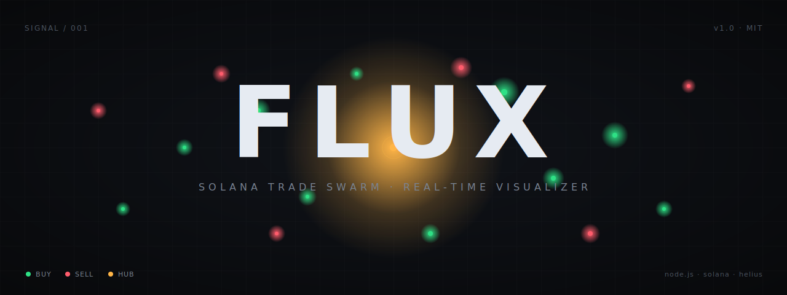

<p align="center">
  
</p>

<h1 align="center">FLUX</h1>

<p align="center"><strong>Watch every buy and sell of any Solana token, live.</strong></p>

<p align="center">
  
  
  
  
</p>

<p align="center">
  <a href="#quick-start">Quick start</a> ·
  <a href="#what-it-does">What it does</a> ·
  <a href="#architecture">Architecture</a> ·
  <a href="#config">Config</a> ·
  <a href="#roadmap">Roadmap</a>
</p>

---

FLUX is a self-hosted, real-time trade visualizer for Solana. Paste a token mint
address, and every buy and every sell flows outward from a center hub across a
canvas, green particles for buys, red for sells. A live feed on the right shows
the wallet, the amount, and a link to the transaction.

It runs against your own Helius RPC endpoint. **No keys are bundled.** You install
it, drop your own API key into a local `.env`, and the tool is yours.

Built for pump.fun launches, Raydium pairs, Meteora pools, Jupiter routes, any
swap Helius can parse.

## What it does

- Subscribes to a token via WebSocket the moment you enter its mint
- Ingests every transaction touching that mint in real time
- Parses buys and sells (direction, SOL amount, token amount, trader wallet)
- Streams each trade to the browser over WebSocket
- Renders trades as radiating particles on an HTML canvas
- Shows a live feed with wallet, amount, and a Solscan link per trade
- Tracks running stats: buys, sells, buy volume, sell volume, net flow,
  average trade size, and 30-second volume bars
- Displays a live buy-pressure gauge

Everything runs locally. Nothing is sent anywhere except to your own RPC endpoint.

## Quick start

Requires **Node.js 18+** and a free Helius API key from
[helius.dev](https://helius.dev).

```bash
git clone https://github.com/YOUR_USERNAME/flux.git
cd flux
npm install
cp .env.example .env
```

Open `.env` and paste your Helius RPC URL:

```
RPC_URL=https://mainnet.helius-rpc.com/?api-key=YOUR_KEY_HERE
```

Then:

```bash
npm start
```

Open <http://localhost:3000>, paste any Solana token mint, press **Enter**.

### One-liner without `.env` (Windows PowerShell)

```powershell
$env:RPC_URL="https://mainnet.helius-rpc.com/?api-key=YOUR_KEY"; node server.js
```

### macOS / Linux

```bash
RPC_URL="https://mainnet.helius-rpc.com/?api-key=YOUR_KEY" node server.js
```

## Architecture

```
                   +--------------------+
                   |   your browser     |
                   |   (canvas + feed)  |
                   +---------+----------+
                             ^
                             | WebSocket (trade events)
                             |
                   +---------+----------+
                   |   FLUX server      |
                   |   (Node.js + ws)   |
                   +----+----------+----+
                        |          |
             logsSubscribe        Enhanced Transactions API
             (WebSocket, free)    (batch of up to 100 signatures)
                        |          |
                        v          v
                   +--------------------+
                   |      Helius        |
                   |   Solana RPC       |
                   +--------------------+
```

The flow in words:

1. Browser opens a WebSocket to the FLUX server and sends `{ action: "watch", mint }`.
2. Server subscribes to logs for that mint over the Helius WebSocket RPC. This is
   free, real-time, and does not burn any HTTP credits.
3. Every incoming signature is queued.
4. A batcher wakes up every ~350 ms and posts up to 100 queued signatures in a
   single call to the Helius Enhanced Transactions API. One HTTP call parses the
   whole batch.
5. Each parsed swap is normalized into `{ side, solAmount, tokenAmount, trader,
   signature, timestamp }` and broadcast over WebSocket to every connected browser.
6. The browser spawns a particle at the center hub, animates it outward, updates
   the feed, and updates the running stats.

## Why the batch path

The naive approach, one `getParsedTransaction` HTTP call per signature, falls
apart on an active pump.fun token:

- 10-40 tx/sec × 1 RPC credit per tx burns the Helius free tier in minutes.
- Parallel requests trigger 429s.
- Sequential requests fall 3-5 seconds behind reality.

FLUX collapses that into batches of 100 signatures per HTTP call, an ~100x
reduction in credit spend and no per-tx round-trip latency.

If your `RPC_URL` is not a Helius endpoint, the server falls back to
`getParsedTransaction` with a small concurrency pool and rate-limit backoff, so
it still works, just slower.

## Config

Everything is optional except `RPC_URL`. Set it in `.env` or as a shell variable.

| var                  | default | meaning                                                      |
|----------------------|---------|--------------------------------------------------------------|
| `RPC_URL`            |         | required, your Helius (or any) RPC endpoint                 |
| `HELIUS_API_KEY`     | auto    | auto-derived from `RPC_URL`; override if using a proxy       |
| `PORT`               | `3000`  | HTTP and WebSocket port                                      |
| `BATCH_INTERVAL_MS`  | `350`   | how often to flush the signature queue                       |
| `BATCH_SIZE`         | `100`   | max signatures per batch (Helius caps at 100)                |
| `MAX_QUEUE`          | `1000`  | drop-oldest cap on the queue to protect memory               |

## Repository layout

```
flux/
├── server.js                 // node server, batching, ws bridge
├── public/
│   └── index.html            // canvas, feed, metrics, single file
├── assets/
│   ├── cover.svg             // README hero
│   └── cover.png             // rendered version for README
├── .env.example              // template, no secrets
├── .gitignore                // .env, node_modules, logs
├── package.json
├── LICENSE
├── CONTRIBUTING.md
└── README.md
```

## Security

- Your Helius API key lives in `.env` only. `.env` is git-ignored.
- Never commit `.env`. If a key ever leaks, rotate it at
  [helius.dev](https://helius.dev) → dashboard → API keys.
- The server has no auth. Do not expose the port to the public internet. Run it
  on `localhost` or behind your own reverse proxy with auth if you must.

## Roadmap

- [x] Batched transaction parsing via Helius Enhanced API
- [x] Fallback to `getParsedTransaction` for non-Helius RPCs
- [x] Live buy pressure and net flow
- [x] 30-second rolling volume bars
- [ ] Token metadata (name, symbol, market cap) in the sidebar
- [ ] Price and mcap chart
- [ ] Whale filter (highlight trades above threshold)
- [ ] Multi-token dashboard (watch several mints at once)
- [ ] Optional Helius webhook path for zero-latency ingestion
- [ ] Simple recording / replay of a session

## Contributing

Small fixes, RPC compatibility notes, and pump-parser tweaks are welcome. See
[CONTRIBUTING.md](CONTRIBUTING.md).

## License

MIT. See [LICENSE](LICENSE). Fork it, break it, tune it.
